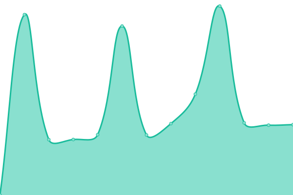

# [📈 Live Status](https://status.theitdept.au): <!--live status--> **🟧 Partial outage**

This repository contains the open-source uptime monitor and status page for [the-it-dept](https://status.theitdept.au), powered by [Upptime](https://github.com/upptime/upptime).

With [Upptime](https://upptime.js.org), you can get your own unlimited and free uptime monitor and status page, powered entirely by a GitHub repository. We use [Issues](https://github.com/the-it-dept/status.theitdept.au/issues) as incident reports, [Actions](https://github.com/the-it-dept/status.theitdept.au/actions) as uptime monitors, and [Pages](https://status.theitdept.au) for the status page.

<!--start: status pages-->
<!-- This summary is generated by Upptime (https://github.com/upptime/upptime) -->
<!-- Do not edit this manually, your changes will be overwritten -->
<!-- prettier-ignore -->
| URL | Status | History | Response Time | Uptime |
| --- | ------ | ------- | ------------- | ------ |
|  [Website](https://theitdept.au) | 🟥 Down | [website.yml](https://github.com/The-IT-Dept/status.theitdept.au/commits/HEAD/history/website.yml) | 

 1678ms
     
 | 

<a href="https://status.theitdept.au/history/website">99.65%</a>
    

|  [Portal](https://portal.theitdept.au) | 🟥 Down | [portal.yml](https://github.com/The-IT-Dept/status.theitdept.au/commits/HEAD/history/portal.yml) | 

 2520ms
     
 | 

<a href="https://status.theitdept.au/history/portal">99.38%</a>
    

|  [Web Hosting Control Panel (web.theitdept.au)](https://web.theitdept.au) | 🟩 Up | [web-hosting-control-panel-web-theitdept-au.yml](https://github.com/The-IT-Dept/status.theitdept.au/commits/HEAD/history/web-hosting-control-panel-web-theitdept-au.yml) | 

 663ms
     
 | 

<a href="https://status.theitdept.au/history/web-hosting-control-panel-web-theitdept-au">98.78%</a>
    

|  [web.oci.theitdept.au](https://web.oci.theitdept.au) | 🟩 Up | [web-oci-theitdept-au.yml](https://github.com/The-IT-Dept/status.theitdept.au/commits/HEAD/history/web-oci-theitdept-au.yml) | 

 567ms
     
 | 

<a href="https://status.theitdept.au/history/web-oci-theitdept-au">100.00%</a>
    

|  [cr1.syd1.theitdept.au](157.20.113.255) | 🟥 Down | [cr1-syd1-theitdept-au.yml](https://github.com/The-IT-Dept/status.theitdept.au/commits/HEAD/history/cr1-syd1-theitdept-au.yml) | 

 0ms
     
 | 

<a href="https://status.theitdept.au/history/cr1-syd1-theitdept-au">0.00%</a>
    

<!--end: status pages-->

[**Visit our status website →**](https://status.theitdept.au)

## 📄 License

- Powered by: [Upptime](https://github.com/upptime/upptime)
- Code: [MIT](./LICENSE) © [Anand Chowdhary](https://anandchowdhary.com), supported by [Pabio](https://pabio.com)
- Data in the `./history` directory: [Open Database License](https://opendatacommons.org/licenses/odbl/1-0/)
